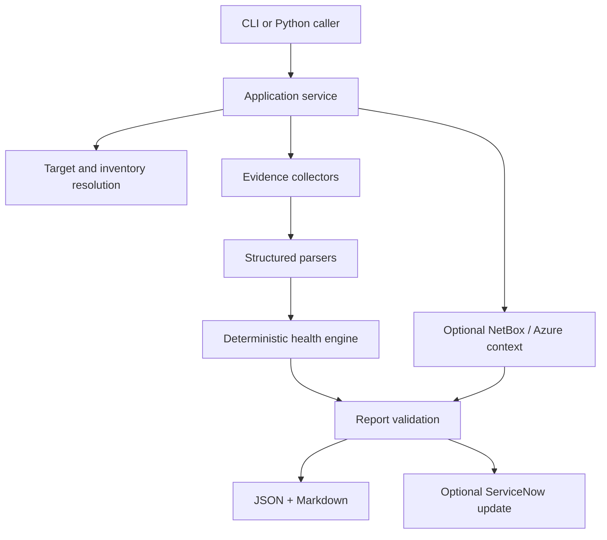

# Network Incident Pack

[](https://github.com/JNHolman/servicenow-incident-pack/actions/workflows/ci.yml)
[](https://github.com/JNHolman/servicenow-incident-pack/actions/workflows/codeql.yml)

A Python network/infrastructure incident automation tool that turns first-pass troubleshooting evidence into structured, repeatable incident reports.

It collects host-side interface, Layer 2–4, and DNS evidence an engineer would normally gather manually, preserves the raw output, parses supported checks into normalized data, applies explicit health rules, and produces JSON + ticket-ready Markdown. Optional NetBox, Azure ARM, and ServiceNow integrations add operational context without changing the core troubleshooting workflow.

## See it run

The repo includes a **live local sandbox** that creates real socket/DNS conditions and runs the normal Incident Pack collection path against them.

```bash
python -m lab.live_demo --out-dir ./lab-output
```

Example from a real live-sandbox run (ports are allocated dynamically):

```text
Live Incident Pack demo matrix
Target: 127.0.0.1
Ports: HTTP=45047, TCP=33755, refused=39097
PASS healthy          status=healthy  reachability=healthy
PASS service-refused  status=degraded reachability=healthy
PASS dns-failure      status=degraded reachability=healthy
```

The demo intentionally produces both passing and failing conditions:

| Case | Real condition | Result |
| --- | --- | --- |
| `healthy` | DNS resolves and both TCP services accept connections | `HEALTHY` |
| `service-refused` | Host responds but one requested TCP service has no listener | `DEGRADED`, reachability remains `HEALTHY` |
| `dns-failure` | IP/TCP path works while a `.invalid` hostname fails resolution | `DEGRADED`, reachability remains `HEALTHY` |

These are **not prebuilt JSON fixtures**. The sandbox uses real localhost listeners, real TCP handshakes/refusals, real DNS resolution failure, the live collectors, parsers, health engine, report validation, and output writers.

Each run writes structured JSON and Markdown under `./lab-output/<case>/`.

A report summary looks like:

```text
Overall: DEGRADED
Reachability: HEALTHY

Collection Summary
Host commands: 6/6 succeeded
TCP checks: 2/3 connected
Parser errors: 0

Key Results
DNS: healthy
Ping: healthy
Traceroute: complete
TCP 443: connected
TCP 80: connected
TCP 22: connection refused
```

For failures that are awkward or unsafe to manufacture locally—such as complete unreachability or a forced collector timeout—the repo also includes deterministic mock scenarios used as repeatable test fixtures. See [Demo Scenarios](docs/DEMO_SCENARIOS.md).

## What it demonstrates

- cross-platform network evidence collection on Linux, macOS, and Windows
- structured parsing of ping, traceroute/tracert, interfaces, routes, and ARP/neighbor data
- TCP service testing with selective retries and explicit failure classification
- bounded `ThreadPoolExecutor` concurrency for independent I/O checks
- deterministic reachability and health semantics instead of generated diagnosis
- YAML/JSON site and device inventory with explicit override precedence
- environment-based secrets handling and report redaction
- read-only NetBox device lookup
- read-only Azure VM/network context enrichment
- explicit ServiceNow incident work-note updates
- versioned JSON + Markdown reporting with validation before write/handoff
- unit, integration, CLI, concurrency, security, and sandbox tests

## Architecture



The CLI is intentionally thin. The same workflow is available through `run_incident_pack()` for reuse by other automation.

See [Architecture](docs/ARCHITECTURE.md) and [Design Decisions](docs/DESIGN_DECISIONS.md).

## Install

Requires **Python 3.10+**.

First verify the interpreter you intend to use:

```bash
python3 --version
```

If that reports Python 3.9 or older, use an installed 3.10+ executable such as `python3.11` or `python3.12` instead.

```bash
git clone https://github.com/JNHolman/servicenow-incident-pack.git
cd servicenow-incident-pack

PYTHON=python3
$PYTHON --version   # must be 3.10+
$PYTHON -m venv .venv
source .venv/bin/activate

python -m pip install --upgrade pip setuptools wheel
python -m pip install -e .

incident-pack --version
```

Windows PowerShell activation:

```powershell
.\.venv\Scripts\Activate.ps1
```

## Basic usage

Live collection:

```bash
incident-pack \
  --target 10.20.30.40 \
  --dns-name app.example.com \
  --ports 443 22 \
  --non-interactive \
  --log-level INFO
```

Inventory-driven collection:

```bash
incident-pack \
  --device app-demo-01 \
  --config config/inventory.example.yaml \
  --non-interactive
```

Effective configuration precedence is deterministic:

```text
CLI override -> device -> site -> global defaults
```

## Health semantics

The tool keeps **network reachability**, **service health**, and **collection quality** separate.

Examples:

- ping failure does not make a target unreachable when TCP succeeds
- `connection_refused` means the service failed, but the returned RST proves the host is reachable
- an intermediate `* * *` traceroute hop does not fail a path when the destination is reached
- a collector failure marks evidence collection incomplete without automatically declaring a network outage

Raw command output is retained beside the normalized fields so the report still contains the underlying evidence.

## Optional operational integrations

### NetBox

Read-only device lookup can resolve a target and add site/role metadata.

```bash
export NETBOX_URL="https://netbox.example.com"
export NETBOX_TOKEN="..."

incident-pack --netbox-device edge-01 \
  --config config/inventory.example.yaml \
  --non-interactive
```

### Azure

Azure Resource Manager enrichment is read-only and adds VM/NIC/VNet/subnet/NSG/IP context to the same incident report. It does **not** provision infrastructure.

```bash
export AZURE_ACCESS_TOKEN="$(az account get-access-token --resource-type arm --query accessToken -o tsv)"

incident-pack \
  --target "$PUBLIC_IP" \
  --ports 22 8080 8081 \
  --azure-vm-resource-id "$VM_ID" \
  --non-interactive
```

See [Azure Lab](docs/AZURE_LAB.md). Live Azure-subscription validation is intentionally documented separately from mocked ARM contract tests.

### ServiceNow

Ticket mutation only occurs when explicitly requested:

```bash
export SERVICENOW_URL="https://instance.service-now.com"
export SERVICENOW_USER="api-user"
export SERVICENOW_PASSWORD="..."

incident-pack \
  --target 10.20.30.40 \
  --ports 443 22 \
  --servicenow-update INC0012345 \
  --non-interactive
```

If the ServiceNow update fails, the local JSON and Markdown evidence remain available.

## Safety and security

The project is intentionally bounded to incident-triage scale:

- maximum 32 unique TCP ports
- maximum 16 workers
- maximum 3 TCP attempts per port
- maximum 30-second TCP connect timeout
- maximum 60-second host-command timeout
- no `shell=True`
- validated host/DNS inputs before OS commands
- HTTPS-only credentialed integrations with TLS verification enabled
- environment-based credentials
- report/API-error secret redaction
- read-only CI permissions, CodeQL, Dependabot, and dependency review

Run the tool only against infrastructure you own or are authorized to troubleshoot. See [SECURITY.md](SECURITY.md).


## Code quality gates

The configured static-quality check is enforced in CI rather than merely documented:

```bash
python -m pip install -e ".[dev]"
ruff check incident_pack.py incidentpack lab scripts tests
```

CI also builds the release ZIP from the tracked Git tree and inspects it for local environments, Git metadata, caches, and build artifacts.

## Tests

```bash
python -m unittest discover -s tests -v
```

The current suite contains **194 tests** covering parsers, error classification, retries, deterministic concurrency ordering, inventory precedence, health semantics, reporting/redaction, NetBox/Azure/ServiceNow adapters, CLI behavior, and the live sandbox.

GitHub Actions runs the suite on Python 3.10, 3.11, and 3.12.

## Release packaging

Release archives are built from the tracked Git tree rather than by zipping a working directory:

```bash
./scripts/build_release.sh v1.1.3
```

That keeps `.git`, virtual environments, caches, generated reports, and build metadata out of distributable ZIPs.

## Validation scope

**Validated:**

- real local TCP/DNS sandbox execution
- Linux/macOS/Windows parser fixtures
- deterministic mock failure scenarios
- YAML/JSON inventory resolution
- NetBox/Azure/ServiceNow REST contract tests with mocked HTTP responses
- application/CLI integration and security guardrails

**Not represented as production validation:**

- active Cisco/Juniper/Palo Alto/Fortinet device collection
- production organization NetBox or ServiceNow environments
- live Azure ARM enrichment against a production subscription

The project is a host-side network/infrastructure incident automation tool, not a multi-vendor network-management platform or an infrastructure-provisioning system.

## Documentation

| Document | Purpose |
| --- | --- |
| [Architecture](docs/ARCHITECTURE.md) | modules, data flow, report boundary |
| [Lab Validation](docs/LAB_VALIDATION.md) | live localhost success/failure cases |
| [Demo Scenarios](docs/DEMO_SCENARIOS.md) | deterministic edge-case fixtures |
| [Azure Lab](docs/AZURE_LAB.md) | real cloud validation procedure |
| [Design Decisions](docs/DESIGN_DECISIONS.md) | key engineering choices |
| [Security](SECURITY.md) | authorization, secrets, vulnerability reporting |

## License

See [LICENSE](LICENSE).
