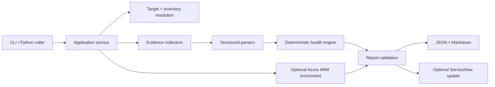

# Network Incident Pack

A Python network/infrastructure incident automation tool that standardizes first-pass host-side evidence collection into **structured JSON** and **ticket-ready Markdown**.

It is designed around the checks engineers actually use during initial triage: DNS, reachability, path, TCP service access, interfaces, routes, neighbors, and local socket state. Raw evidence is retained while supported outputs are parsed into deterministic operational summaries.

## Core capabilities

- Linux, macOS, and Windows host-side collection
- DNS resolution using Python sockets
- ping packet-loss/latency parsing
- traceroute/tracert hop parsing
- TCP connectivity checks with selective retries
- structured interface, route, and ARP/neighbor evidence
- bounded `ThreadPoolExecutor` concurrency for independent I/O checks
- YAML/JSON site and device inventory
- environment-based credential handling
- optional read-only NetBox device lookup
- optional read-only Azure VM/network context enrichment
- optional explicit ServiceNow work-note update
- deterministic health and collection-completeness summaries
- versioned JSON report contract and Markdown reporting
- deterministic public-safe failure scenarios
- unit, integration, and CLI smoke tests

The core remains vendor-neutral and location-agnostic. The same collection path can target on-premises, Internet, or cloud-hosted systems; NetBox, Azure, and ServiceNow are optional context/workflow integrations.

## Architecture



See [Architecture](docs/ARCHITECTURE.md) and [Design Decisions](docs/DESIGN_DECISIONS.md).

## Install

Requires Python 3.10+. Clone the existing project repository and install it in an isolated environment:

```bash
git clone https://github.com/JNHolman/servicenow-incident-pack.git
cd servicenow-incident-pack
python3 -m venv .venv
source .venv/bin/activate
python3 -m pip install --upgrade pip
python3 -m pip install -e .
```

On Windows PowerShell, activate the environment with `.\.venv\Scripts\Activate.ps1`.

This installs the `incident-pack` console command. The legacy `python3 incident_pack.py` entry point remains supported.

```bash
incident-pack --version
incident-pack --help
```

## Quick demo

A deterministic mock run is safe for public demonstrations and does not expose local interface, route, or neighbor information:

```bash
incident-pack \
  --target 10.20.30.40 \
  --dns-name app.example.com \
  --ports 443 80 22 \
  --mock \
  --non-interactive
```

Outputs:

- `incident_pack_<host>_<timestamp>.json`
- `incident_pack_<host>_<timestamp>.md`

Committed public-safe samples are available in [`examples/`](examples/).

## Live collection

```bash
incident-pack \
  --target 10.20.30.40 \
  --dns-name app.example.com \
  --ports 443 22 \
  --non-interactive \
  --log-level INFO
```

Platform-aware commands include:

- **Linux:** `ip addr`, `ip route`, `ip neigh`, `ss -tulpn`
- **macOS:** `ifconfig`, `netstat -rn`, `arp -an`, `netstat -anv`
- **Windows:** `ipconfig /all`, `route print`, `arp -a`, `netstat -ano`

Command timeouts, missing executables, OS errors, and non-zero exits are recorded as structured collection evidence instead of terminating the whole incident run.

## Lightweight live sandbox

No Docker or network-device emulator is required. Run the live demo matrix from the repository root:

```bash
python3 -m lab.live_demo --out-dir ./lab-output
```

It executes three real loopback cases: healthy services, a deliberately refused TCP service, and DNS failure with working IP/TCP reachability. Each case uses the normal live collector and writes JSON + Markdown.

For manual commands and the exact failure setup, see [Lab Validation](docs/LAB_VALIDATION.md).

## Deterministic incident scenarios

Mock scenarios make failure semantics repeatable without intentionally breaking a live environment:

```bash
incident-pack --target 10.20.30.40 --ports 443 22 \
  --mock --mock-scenario service-refused --non-interactive

incident-pack --target 10.20.30.40 --ports 443 22 \
  --mock --mock-scenario unreachable --non-interactive
```

Supported scenarios:

- `baseline`
- `healthy`
- `dns-failure`
- `service-refused`
- `unreachable`
- `collector-timeout`

See [Demo Scenarios](docs/DEMO_SCENARIOS.md).

## Health semantics

The health engine uses explicit rules rather than generated diagnosis.

Examples:

- ICMP failure does not make a host unreachable when TCP succeeds.
- `connection_refused` means the requested service failed, but the returned RST is positive reachability evidence.
- intermediate traceroute timeouts do not fail the path when the destination is reached.
- collector failures affect **collection quality** independently of **network health**.

Raw command output remains available alongside normalized fields for audit and deeper troubleshooting.

## Inventory-driven execution

Local inventory supports YAML and JSON.

```bash
incident-pack \
  --device app-demo-01 \
  --config config/inventory.example.yaml \
  --non-interactive
```

Effective settings use explicit precedence:

```text
CLI override -> device -> site -> global defaults
```

A CLI value such as `--ports 8443 22` overrides configured ports only for that run.

## Bounded concurrency and retries

```bash
incident-pack \
  --target 10.20.30.40 \
  --ports 443 22 8443 \
  --workers 4 \
  --tcp-timeout 3 \
  --tcp-attempts 2 \
  --non-interactive
```

Independent host commands and TCP checks use bounded thread pools. Results are restored to deterministic configured order even when workers finish out of order.

Retries are selective. Transient timeouts/resets may be retried; active connection refusal, invalid configuration, missing executables, and similar deterministic failures are not blindly repeated.

### Runtime safety limits

One execution is intentionally bounded to incident-triage scale:

- maximum 32 unique TCP ports
- maximum 16 collection workers
- maximum 3 TCP attempts per port
- maximum 30-second TCP connect timeout
- maximum 60-second host-command timeout

The same limits apply to CLI overrides and inventory/config values. Run the tool only against infrastructure you own or are authorized to troubleshoot.

## NetBox integration

NetBox lookup is optional and read-only. Credentials are read from environment variables.

```bash
export NETBOX_URL="https://netbox.example.com"
export NETBOX_TOKEN="..."

incident-pack \
  --netbox-device edge-01 \
  --config config/inventory.example.yaml \
  --non-interactive
```

The adapter looks up a device through `/api/dcim/devices/`, uses its primary IP as the target, and enriches the report with site/role metadata. Local config can still supply service-port policy.

## Azure network context enrichment

Azure enrichment is optional and read-only. It does not provision resources or replace the normal network checks. The target is still diagnosed with DNS, ping, traceroute, TCP, and local host evidence; Azure Resource Manager adds cloud-side context for the VM and its attached network interfaces.

Obtain a short-lived ARM token with Azure CLI and pass the VM resource ID explicitly:

```bash
export AZURE_ACCESS_TOKEN="$(az account get-access-token --resource-type arm --query accessToken -o tsv)"
VM_ID="$(az vm show -g incident-pack-lab -n ip-lab-vm --query id -o tsv)"
PUBLIC_IP="$(az vm show -d -g incident-pack-lab -n ip-lab-vm --query publicIps -o tsv)"

incident-pack \
  --target "$PUBLIC_IP" \
  --ports 22 8080 8081 \
  --azure-vm-resource-id "$VM_ID" \
  --non-interactive
```

When available, the report adds: Azure region, resource group, VM size/state, NIC names, private/public IPs, VNet/subnet names, and attached NSG name. Subscription IDs and bearer tokens are intentionally omitted from report output.

See [Azure Lab](docs/AZURE_LAB.md) for a disposable VM validation workflow.

## ServiceNow integration

ServiceNow mutation is deliberately explicit:

```bash
export SERVICENOW_URL="https://instance.service-now.com"
export SERVICENOW_USER="api-user"
export SERVICENOW_PASSWORD="..."

incident-pack \
  --target 10.20.30.40 \
  --ports 443 22 \
  --non-interactive \
  --servicenow-update INC0012345
```

The client resolves the incident number to `sys_id` and appends the generated Markdown to `work_notes`. Local evidence is still retained if the external update fails.

Real credentials belong in environment variables only. `.env.example` documents variable names without values.

## Security

The project avoids shell execution (`shell=True`), validates targets before passing them to operating-system network commands, requires HTTPS integration endpoints, keeps TLS verification enabled, bounds concurrency/retries/timeouts, and sanitizes report/integration error content before external handoff. GitHub configuration includes read-only CI permissions, Dependabot update checks, dependency review, and CodeQL analysis.

See [SECURITY.md](SECURITY.md) for authorization boundaries, credential handling, and vulnerability reporting.

## Reusable Python API

The CLI delegates to the same application service available to other automation:

```python
from incidentpack.application import IncidentPackRequest, run_incident_pack

result = run_incident_pack(
    IncidentPackRequest(
        target="10.20.30.40",
        ports=[443, 22],
        non_interactive=True,
        out_dir="./reports",
    )
)

print(result.evidence["health"])
print(result.output_paths["json"])
```

Collectors and integration clients can be injected for tests without routing through `argparse` or subprocess execution.

## Report contract

The current JSON report uses `schema_version: 2` and includes:

- metadata and incident context
- inventory context
- collection policy
- DNS/TCP evidence
- raw command evidence
- normalized ping/traceroute/interface/route/neighbor evidence
- deterministic health summary
- deterministic collection summary
- optional cloud context and integration status

Before output or external handoff, report validation checks required fields, status values, collection-summary consistency, JSON serializability, and secret-bearing keys. Recognizable Bearer/Basic authorization and credential-assignment patterns are also redacted from arbitrary report text and API error bodies. JSON and Markdown files are written atomically per file with temporary-file replacement.

## Tests

```bash
python3 -m unittest discover -s tests -v
```

The suite covers parser formats, target validation, timeout/error classification, retry policy, concurrent result ordering, inventory precedence, health semantics, report validation/redaction, HTTP retry behavior, NetBox/Azure/ServiceNow adapters, scenario behavior, application-service injection, local sandbox endpoints, and CLI execution.

GitHub Actions runs the suite on Python 3.10, 3.11, and 3.12.

## Validation scope

Validated in this repository:

- deterministic mock scenarios
- Linux/macOS/Windows parser fixtures
- real local loopback HTTP/TCP sandbox endpoints
- local live Incident Pack execution against the loopback sandbox
- YAML/JSON inventory loading and precedence
- mocked REST contract tests for NetBox, Azure Resource Manager, and ServiceNow
- compile checks, application tests, and CLI smoke tests

Not claimed as validated:

- active production network devices
- SSH/API collection from Cisco, Juniper, Palo Alto, Fortinet, Aruba, or similar platforms
- production organization NetBox/ServiceNow environments
- live Azure Resource Manager enrichment against the user's subscription (see Azure Lab for the validation procedure)

Those boundaries are intentional. This is a host-side network incident automation tool with optional operational integrations, not a multi-vendor network management platform.

## Project scope

Cloud-specific additions must remain tied to troubleshooting context. Azure enrichment is read-only operational metadata, not provisioning. General cloud-platform architecture, Kubernetes, and unrelated DevOps infrastructure remain outside this repository.

## License

See [LICENSE](LICENSE).
