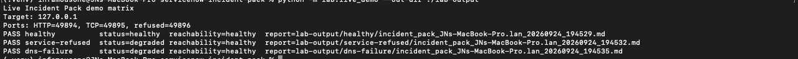

# Network Incident Pack

[](https://github.com/JNHolman/network-incident-pack/actions/workflows/ci.yml)
[](https://github.com/JNHolman/network-incident-pack/actions/workflows/codeql.yml)

When a service is having problems, a network engineer often starts by running the same checks manually: DNS lookup, ping, traceroute, TCP connectivity, interface state, routes, neighbors, and local socket checks. The results then have to be interpreted, organized, and copied into an incident ticket.

**Network Incident Pack automates that first pass.** It collects host-side interface, Layer 2–4, and DNS evidence, preserves the raw output, parses supported results into structured data, applies explicit health rules, and writes consistent JSON and ticket-ready Markdown reports.

Optional NetBox, Azure Resource Manager, and ServiceNow integrations add inventory, cloud, and ticket context without changing the core troubleshooting workflow.

## Why the health model matters

The tool does not treat one failed check as proof that the host or network is down.

- **Ping failure does not automatically mean unreachable** when TCP succeeds.
- **TCP connection refused means the service failed, but the host answered.** The returned RST is positive Layer 4 reachability evidence.
- **An intermediate traceroute timeout does not fail the path** when the destination is reached.
- **Collector failure is separate from network failure.** Missing local evidence makes collection incomplete; it does not automatically declare an outage.

That separation between **reachability**, **service health**, and **collection quality** is the core operational idea behind the project.

## Live demo

The repository includes a **[live local sandbox](lab/live_demo.py)** that creates real socket and DNS conditions and runs the normal Incident Pack collection path against them.

```bash
python -m lab.live_demo --out-dir ./lab-output
```

Example result:

```text
Live Incident Pack demo matrix
Target: 127.0.0.1
Ports: HTTP=45047, TCP=33755, refused=39097
PASS healthy          status=healthy  reachability=healthy
PASS service-refused  status=degraded reachability=healthy
PASS dns-failure      status=degraded reachability=healthy
```

| Case | Real condition | Result |
| --- | --- | --- |
| `healthy` | DNS resolves and both requested TCP services accept connections | `HEALTHY` |
| `service-refused` | Host responds but a requested TCP service has no listener | `DEGRADED`, reachability remains `HEALTHY` |
| `dns-failure` | IP/TCP path works while the requested DNS name fails resolution | `DEGRADED`, reachability remains `HEALTHY` |



The sandbox uses real localhost listeners, real TCP handshakes/refusals, real DNS resolution, the normal collectors/parsers, the health engine, report validation, and output writers. It is separate from the deterministic mock scenarios used for edge cases that are awkward or unsafe to manufacture locally.

See the [sandbox implementation](lab/local_sandbox.py), [lab validation notes](docs/LAB_VALIDATION.md), and [mock scenarios](docs/DEMO_SCENARIOS.md).

## What the project includes

- Linux, macOS, and Windows host-side evidence collection
- DNS, ping, traceroute/tracert, TCP, interfaces, routes, neighbors, and local socket evidence
- structured parsers while retaining raw command output
- bounded concurrent I/O collection with deterministic result ordering
- selective TCP and HTTP retries for transient failures
- YAML/JSON site and device inventory with explicit override precedence
- deterministic health and collection-completeness summaries
- versioned JSON and Markdown report validation
- read-only NetBox device lookup
- read-only Azure VM/NIC/VNet/subnet/NSG enrichment
- explicit ServiceNow work-note updates only when requested
- environment-based credential handling and report redaction
- CI, CodeQL, dependency review, Ruff, release verification, and automated tests

## Quick start

Requires **Python 3.10+**.

```bash
python3 --version

git clone https://github.com/JNHolman/network-incident-pack.git
cd network-incident-pack

python3 -m venv .venv
source .venv/bin/activate
python -m pip install --upgrade pip setuptools wheel
python -m pip install -e .

incident-pack --version
```

If `python3 --version` reports Python 3.9 or older, use an installed Python 3.10+ executable such as `python3.11` or `python3.12` when creating the virtual environment.

Windows PowerShell activation:

```powershell
.\.venv\Scripts\Activate.ps1
```

## Basic usage

```bash
incident-pack \
  --target 10.20.30.40 \
  --dns-name app.example.com \
  --ports 443 22 \
  --non-interactive \
  --log-level INFO
```

Inventory-driven collection:

```bash
incident-pack \
  --device app-demo-01 \
  --config config/inventory.example.yaml \
  --non-interactive
```

Configuration precedence is deterministic:

```text
CLI override -> device -> site -> global defaults
```

## Optional integrations

The core Incident Pack works without external systems. Integrations are additive.

| Integration | Purpose | Behavior |
| --- | --- | --- |
| NetBox | resolve device/inventory context | read-only |
| Azure ARM | enrich reports with VM and network control-plane context | read-only |
| ServiceNow | add the finished incident summary to an existing ticket | explicit write only |

Azure enrichment does **not** provision infrastructure. The live Azure validation workflow is documented in [Azure Lab](docs/AZURE_LAB.md); the ARM adapter is currently covered by mocked HTTP contract tests until that real-cloud validation is completed.

## Architecture

The CLI is a thin entry point over a reusable application service. Collection, parsing, health evaluation, integrations, and reporting are separated so the same workflow can be called from Python without invoking the CLI.

See [Architecture](docs/ARCHITECTURE.md) and [Design Decisions](docs/DESIGN_DECISIONS.md) for the module/data-flow details.

## Safety and validation

The tool is intentionally bounded to incident-triage scale: port count, worker count, retry count, and timeouts are capped. Credentialed integration endpoints require HTTPS, redirects are not automatically followed with credentials, and credentials come from environment variables rather than CLI arguments or inventory files.

Run it only against infrastructure you own or are authorized to troubleshoot. See [Security](SECURITY.md).

Current validation includes:

- real localhost TCP/DNS sandbox execution
- Linux/macOS/Windows parser fixtures
- deterministic mock failure scenarios
- inventory-resolution tests
- NetBox/Azure/ServiceNow contract tests with mocked HTTP responses
- CLI/application integration tests
- security/input-validation tests
- release-archive verification

Not represented as production validation:

- active Cisco/Juniper/Palo Alto/Fortinet device collection
- production organization NetBox or ServiceNow environments
- live Azure ARM enrichment against a production subscription

The project is a host-side network/infrastructure incident automation tool, not a multi-vendor network-management platform or an infrastructure-provisioning system.

## Tests and quality gates

```bash
python -m pip install -e ".[dev]"
python -m unittest discover -s tests -v
ruff check incident_pack.py incidentpack lab scripts tests
```

GitHub Actions runs the automated suite across supported Python versions and verifies the release archive produced from the tracked Git tree.

## Documentation

| Document | What it explains |
| --- | --- |
| [Architecture](docs/ARCHITECTURE.md) | how requests move through collection, parsing, health evaluation, integrations, and reporting |
| [Design Decisions](docs/DESIGN_DECISIONS.md) | why raw evidence is retained, why health states are separated, and why integrations stay optional |
| [Lab Validation](docs/LAB_VALIDATION.md) | how the real localhost success/failure demo works |
| [Demo Scenarios](docs/DEMO_SCENARIOS.md) | deterministic fixtures for unreachable/timeout and other edge cases |
| [Azure Lab](docs/AZURE_LAB.md) | disposable VM workflow for real cloud validation |
| [Security](SECURITY.md) | authorization scope, endpoint/credential handling, redaction limits, and vulnerability reporting |

## License

See [LICENSE](LICENSE).
