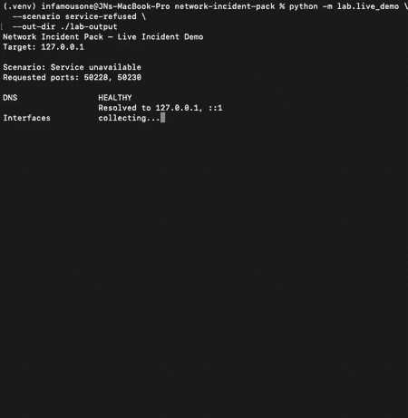

# Network Incident Pack

[](https://github.com/JNHolman/network-incident-pack/actions/workflows/ci.yml)
[](https://github.com/JNHolman/network-incident-pack/actions/workflows/codeql.yml)

When a service is having problems, a network engineer usually starts by proving the basics: does the name resolve, is the host reachable, where does the path stop, is the requested service answering, and does the local machine have the interfaces and routes it needs?

During an incident, engineers can lose valuable time repeating those checks, interpreting partial signals differently, and manually turning troubleshooting notes into something another engineer or support team can use. That creates duplicated work and slower handoffs when the team needs a clear picture quickly.

**Network Incident Pack automates and standardizes that first pass.** It collects host-side network evidence, keeps the raw command output, turns supported results into structured data, applies explicit health rules, and produces consistent JSON and ticket-ready Markdown reports.

The goal is not to replace an engineer. It is to reduce repetitive first-pass work, make the evidence easier to interpret, and give the next person a consistent incident handoff.


## Live demo

The repository includes a **[live local sandbox](lab/live_demo.py)** that creates real socket and DNS conditions and sends them through the normal Incident Pack workflow. The focused demo below is not a replay of prebuilt output: the status text changes as the real DNS, host, TCP, health, and report steps complete.



[Open the animated demo directly](assets/network-incident-pack-demo.gif) or [watch the MP4 version](assets/network-incident-pack-demo.mp4) if your viewer does not animate GIFs.

The focused `service-refused` scenario is useful because it shows the main health-model distinction in one short run: one TCP service connects, another returns a refusal, overall service health degrades, but host reachability remains healthy because the returned RST proves a Layer 4 responder answered.

The full live matrix covers:

| Case | Real condition | Expected result |
| --- | --- | --- |
| `healthy` | DNS resolves and both requested TCP services accept connections | `HEALTHY` |
| `service-refused` | the host responds but one requested TCP service has no listener | `DEGRADED`, reachability remains `HEALTHY` |
| `dns-failure` | the IP/TCP path works while the requested DNS name fails resolution | `DEGRADED`, reachability remains `HEALTHY` |

The sandbox uses real localhost listeners, TCP handshakes/refusals, DNS resolution, host commands, parsers, health evaluation, report validation, and output writers. A [sample Markdown incident report](examples/sample_output.md) shows the human-readable handoff. See [Validation](docs/VALIDATION.md) for the live evidence, deterministic coverage, mocked integration boundaries, and validation limits.

## Why the health model matters

A single failed check rarely tells the whole story.

- **Ping failure does not automatically mean the host is unreachable.** TCP may still prove a working path.
- **TCP connection refused is a service failure, not proof of a dead host.** The returned RST proves a Layer 4 responder answered.
- **An intermediate traceroute timeout does not fail the path** when the destination is eventually reached.
- **Collector failure is separate from network failure.** Missing local evidence makes the collection incomplete; it does not automatically mean the network is down.

Network Incident Pack therefore evaluates **reachability**, **service health**, and **collection quality** separately.

## How an incident run works

| Step | What the tool does | Why it matters |
| --- | --- | --- |
| 1 | resolves the target and effective configuration | makes the run deterministic before collection starts |
| 2 | checks local interfaces, routes, neighbors, and sockets | shows whether the troubleshooting host has the local network state it needs |
| 3 | checks DNS, ping, and traceroute/tracert | separates name resolution, ICMP behavior, and path visibility |
| 4 | tests requested TCP services | proves whether a specific Layer 4 service accepts, refuses, resets, or times out |
| 5 | parses supported command output while retaining the raw evidence | gives automation structured data without removing the engineer's original evidence |
| 6 | evaluates health from the combined evidence | avoids treating one protocol as authoritative for every failure |
| 7 | sanitizes and validates the evidence, adds requested external context, revalidates, and writes the report | produces a consistent handoff without letting an integration bypass the report contract |

## What the project includes

- Linux, macOS, and Windows host-side evidence collection and parsing
- DNS, ping, traceroute/tracert, TCP, interfaces, routes, neighbors, and local socket evidence
- raw evidence retained alongside normalized structured results
- bounded concurrent I/O collection with deterministic result ordering
- selective TCP and HTTP retries for transient failures
- YAML/JSON inventory with explicit configuration precedence
- deterministic health evaluation and collection-completeness summaries
- versioned JSON and Markdown report validation
- optional read-only NetBox device lookup
- optional read-only Azure VM/NIC/VNet/subnet/NSG enrichment
- explicit ServiceNow work-note updates only when requested
- environment-based credential handling and report redaction
- CI, CodeQL, dependency review, Ruff, release verification, and automated tests

## Optional integrations

The core Incident Pack works without external systems.

| Integration | Purpose | Behavior |
| --- | --- | --- |
| NetBox | resolve device and inventory context | read-only |
| Azure ARM | add VM and cloud network control-plane context | read-only |
| ServiceNow | add the finished incident summary to an existing ticket | explicit write only |

Azure enrichment does **not** provision infrastructure. The adapter is covered by HTTP contract tests and has also been validated against a live Azure VM from an external macOS client.

## Engineering

The CLI is a thin entry point over a reusable application service. Collection, parsing, health evaluation, integrations, and reporting are separated so the workflow is not tied to terminal argument parsing.

The project also keeps resource use bounded: port count, worker count, retry count, and command/TCP timeouts are capped. Credentialed integration endpoints require HTTPS, redirects are not automatically followed with credentials, and credentials come from environment variables rather than command-line arguments or inventory files.

See [Engineering and Architecture](docs/ENGINEERING.md) for the application flow and the reasons behind the main design choices.

## Validation

Current validation includes:

- real localhost TCP/DNS sandbox execution
- Linux/macOS/Windows parser fixtures
- deterministic failure scenarios
- inventory-resolution tests
- NetBox/Azure/ServiceNow contract tests with mocked HTTP responses
- live Azure VM validation with ARM enrichment for VM/NIC/IP/VNet/subnet/NSG context
- CLI/application integration tests
- security/input-validation tests
- release-archive verification

Live Azure validation is now complete for a disposable Ubuntu VM. The external run kept reachability **HEALTHY** even when ICMP failed, traceroute did not reach the target, and one requested TCP service timed out because another TCP service connected successfully. ARM enrichment returned the VM, NIC, private/public IPs, VNet, subnet, NSG, VM size, provisioning state, and power state. See the [sanitized Azure validation evidence](examples/azure_validation.md).

The project is a host-side network/infrastructure incident automation tool. It is not represented as a multi-vendor network-management platform, an infrastructure-provisioning system, or validation against production organization environments.

See [Validation](docs/VALIDATION.md) for the evidence boundaries.

## Optional: run the demo locally

Requires Python 3.10+.

```bash
python -m pip install -e .

# focused portfolio demo
python -m lab.live_demo --scenario service-refused --out-dir ./lab-output

# full three-scenario validation matrix
python -m lab.live_demo --out-dir ./lab-output
```

This is optional. The repository and demo output are intended to be understandable without requiring a reviewer to recreate the development environment.

## Documentation

| Document | Purpose |
| --- | --- |
| [Engineering and Architecture](docs/ENGINEERING.md) | how the workflow is built and why the main engineering choices were made |
| [Validation](docs/VALIDATION.md) | what has been proven live, what is deterministic/mock coverage, and the validation boundaries |
| [Security](SECURITY.md) | authorization scope, endpoint/credential handling, redaction limits, and vulnerability reporting |

## License

See [LICENSE](LICENSE).
