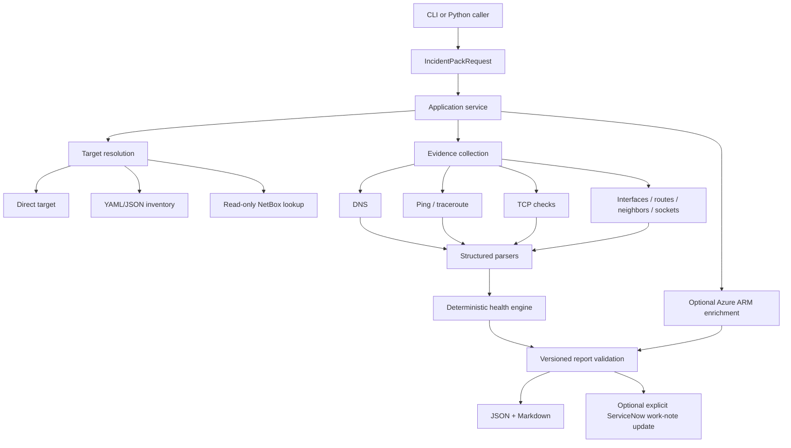

# Architecture

Network Incident Pack is organized as a small application rather than a single troubleshooting script. The CLI is only one entry point; the same workflow can be called directly from Python.

## Runtime boundaries

- `incidentpack/cli.py` — argument parsing and terminal output only.
- `incidentpack/application.py` — reusable orchestration boundary and dependency injection.
- `incidentpack/inventory.py` / `config.py` — target and policy resolution.
- `incidentpack/evidence.py` — live/mock evidence assembly.
- `incidentpack/collectors/` — bounded concurrent host commands and TCP checks.
- `incidentpack/parsers/` — platform-aware normalization of raw command evidence.
- `incidentpack/health.py` — deterministic reachability/service/host-state conclusions.
- `incidentpack/integrations/` — HTTP, NetBox, Azure ARM, and ServiceNow adapters.
- `incidentpack/reporting/` — schema validation, Markdown rendering, and atomic output writes.
- `incidentpack/scenarios.py` — deterministic public-safe failure scenarios.
- `incident_pack.py` — legacy-compatible entry point.

## Data flow

1. A caller supplies a direct target, local inventory device, or NetBox device.
2. Configuration precedence resolves effective DNS name, ports, timeouts, retries, and worker limits.
3. Independent I/O checks run concurrently within bounded thread pools.
4. Raw evidence is retained while supported outputs are parsed into normalized fields.
5. Explicit health rules combine independent evidence without treating one protocol as authoritative for every condition.
6. Optional Azure ARM enrichment adds VM/NIC/VNet/subnet/NSG context without changing the network-health decision rules.
7. The report contract is sanitized/validated before external use or disk output.
8. JSON and Markdown are written atomically per file.
9. ServiceNow mutation occurs only when the operator explicitly requests it.

## Report contract

The JSON document contains a `schema_version` so downstream consumers can detect incompatible report changes. Network health and collection completeness are separate concepts: a collector can fail while the target remains reachable, and a network failure can be captured by fully successful collectors.
