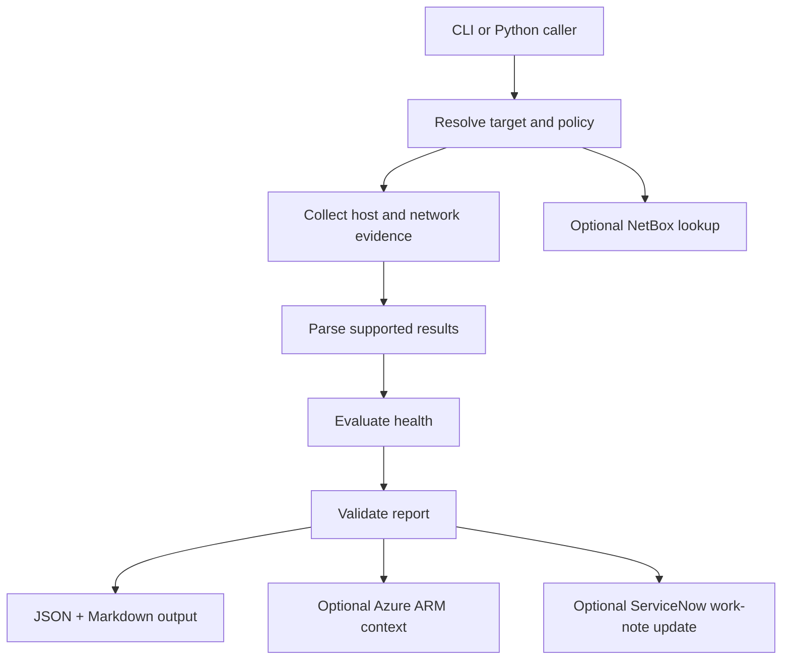

# Engineering and Architecture

This document explains how Network Incident Pack is put together and why the main engineering choices were made. The goal is to keep the design understandable to an engineer reviewing the project without turning the documentation into an implementation manual.

## Application flow


```mermaid
flowchart TD
    A[CLI or Python caller] --> B[Resolve target and policy]
    B --> C[Collect host and network evidence]
    C --> D[Parse supported results]
    D --> E[Evaluate health]
    E --> F[Validate report]
    F --> G[JSON + Markdown output]
    B --> H[Optional NetBox lookup]
    F --> I[Optional Azure ARM context]
    F --> J[Optional ServiceNow work-note update]
```

The CLI is only an entry point. The reusable application service performs the actual workflow.

## What each stage is doing

### 1. Resolve the target and effective policy

A run can start from a direct IP/hostname, local YAML/JSON inventory, or a read-only NetBox device lookup.

Configuration precedence is explicit:

```text
CLI override -> device -> site -> global defaults
```

That keeps the effective DNS name, ports, timeouts, retry limits, and worker limits predictable.

### 2. Collect evidence

The live path gathers the same first-pass information an engineer would normally collect manually:

- interfaces
- routing table
- ARP/neighbor cache
- ping
- traceroute/tracert
- local socket state
- requested TCP service checks
- DNS resolution

Independent I/O work uses bounded thread pools so slow checks do not have to run one after another. Worker counts, timeouts, port counts, and retry counts are capped.

### 3. Parse without throwing away the original evidence

Supported command output is normalized into cross-platform structures that the health engine can evaluate consistently.

The original command output is also retained. Structured data is useful for automation, but the raw evidence is still valuable during escalation or when a parser does not capture every detail an engineer wants to inspect.

### 4. Evaluate the evidence together

The health engine does not allow one protocol to decide every outcome.

Examples:

- a failed ping does not automatically mean the target is unreachable when TCP succeeds
- a TCP refusal means the requested service failed, while the returned RST still proves Layer 4 reachability
- an intermediate traceroute timeout does not fail the route when the destination is reached
- missing collector data affects collection completeness separately from target health

This is why the report keeps **reachability**, **service health**, and **collection quality** separate.

### 5. Validate the report

Reports use a versioned schema. Before output or an external handoff, the application checks required fields, collection-summary consistency, JSON serialization, and forbidden secret-bearing fields.

Recognizable credential content is redacted before the report is written or sent to another system.

### 6. Add optional external context

External systems are deliberately additive rather than required.

- **NetBox** can resolve device/inventory context and is read-only.
- **Azure ARM** can add VM, NIC, IP, VNet, subnet, and NSG context and is read-only.
- **ServiceNow** is the only write integration and updates work notes only when explicitly requested.

A cloud-hosted target still goes through the same network checks. Azure metadata adds control-plane context; it does not replace packet-path evidence.

## Why the implementation is split into modules

The main boundaries are intentionally straightforward:

- `incidentpack/cli.py` — terminal argument parsing and presentation
- `incidentpack/application.py` — reusable workflow orchestration
- `incidentpack/inventory.py` and `config.py` — target/configuration resolution
- `incidentpack/evidence.py` — live/mock evidence assembly
- `incidentpack/collectors/` — host commands and TCP checks
- `incidentpack/parsers/` — cross-platform structured parsing
- `incidentpack/health.py` — deterministic health decisions
- `incidentpack/integrations/` — NetBox, Azure ARM, ServiceNow, and shared HTTP behavior
- `incidentpack/reporting/` — schema validation, Markdown rendering, and atomic output
- `incidentpack/scenarios.py` — deterministic edge-case scenarios

Keeping the CLI thin makes the workflow callable from Python and easier to test without driving terminal arguments.

## Key design choices

### Bounded concurrency instead of unlimited parallelism

Network and host checks spend much of their time waiting on I/O. Running independent checks concurrently reduces collection time, but the worker pool is bounded so a large request cannot create unlimited threads.

Result ordering is restored before reporting so the output remains deterministic.

### Selective retries instead of retrying every failure

Timeouts, resets, and transient HTTP failures can be temporary, so those conditions may be retried.

A TCP connection refusal is different: the remote side already answered. Retrying it immediately usually adds delay without changing the meaning of the evidence, so it is recorded as a service failure rather than treated like a transient timeout.

### Raw plus structured evidence

The parser output gives the application stable fields to reason about. The raw command output gives the engineer the original evidence.

The project keeps both because incident automation should make evidence easier to use, not remove the ability to inspect it.

### External systems remain optional

The core troubleshooting workflow does not depend on NetBox, Azure, or ServiceNow being available. That keeps a failure in an external API from becoming a requirement for basic network evidence collection.

### Release artifacts come from Git

Release ZIPs are built from the tracked Git tree instead of copying the maintainer's working directory. Local virtual environments, caches, generated reports, and repository metadata therefore cannot accidentally enter a release archive simply because they exist on disk.

## Scope

Network Incident Pack is intentionally focused on host-side network and infrastructure incident triage.

It is not intended to become:

- a full network-management system
- a device-configuration platform
- an infrastructure-provisioning tool
- a replacement for packet captures, device telemetry, or an engineer's deeper investigation

The value of the project is the repeatable first pass: collect useful evidence, interpret it consistently, and produce a clean incident handoff.
